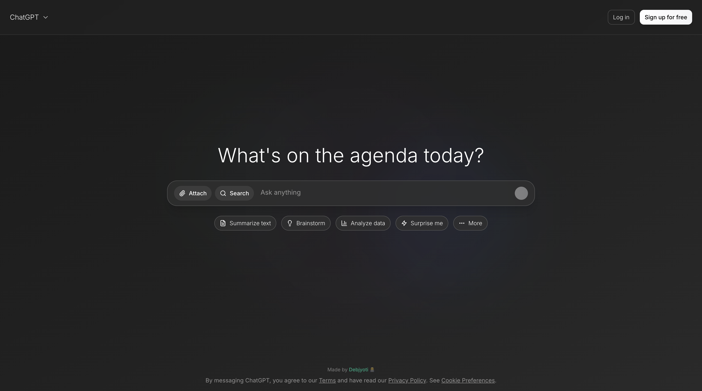

# 🧠 ChatGPT Clone

A modern, full-featured ChatGPT clone built with cutting-edge web technologies. This application delivers an authentic AI chat experience with advanced features including persistent conversations, file attachments, memory integration, and real-time streaming responses.

**Made by Debjyoti** 👨‍💻

### 🌟 Application Preview


### Demo Link: [YouTube](https://www.youtube.com/watch?v=5015VP6ywXU)
---

## ✨ Features

- 🤖 **AI-Powered Conversations** - Seamless integration with OpenAI GPT models
- 👤 **User Authentication** - Secure sign-in/sign-up with Clerk
- 💾 **Persistent Chat History** - All conversations saved and accessible
- 🔄 **Message Regeneration** - Regenerate AI responses for better results
- 📎 **File Attachments** - Upload and discuss documents, images, and more
- 🧠 **Memory Integration** - AI remembers context across conversations
- ⚡ **Real-time Streaming** - Live response streaming for better UX
- 📱 **Responsive Design** - Optimized for desktop, tablet, and mobile
- 🎨 **Modern UI/UX** - Beautiful interface with smooth animations
- 🔍 **Chat Search** - Find previous conversations quickly
- 🌙 **Dark Theme** - Eye-friendly dark mode interface

---

## 🛠 Tech Stack

| Category | Technology |
|----------|------------|
| **Framework** | Next.js 15 (App Router) |
| **Database** | MongoDB |
| **Authentication** | Clerk |
| **AI Integration** | OpenAI GPT API |
| **Memory System** | Mem0 AI |
| **File Storage** | Cloudinary |
| **Styling** | Tailwind CSS |
| **Deployment** | Docker & Docker Compose |
| **Language** | TypeScript |

---

## 🚀 Getting Started

### Prerequisites

- Node.js 18+ installed
- MongoDB database (local or cloud)
- OpenAI API key
- Clerk account for authentication

### 1. Clone the Repository

```bash
git clone https://github.com/Debjyoti2004/ChatCPT-Clone.git
cd ChatCPT-Clone
```

### 2. Install Dependencies

Using npm:
```bash
npm install
```

Or using pnpm (if installed):
```bash
pnpm install
```

### 3. Environment Setup

Create a `.env` file in the root directory and add your environment variables:

```env
# Database
MONGODB_URI=your_mongodb_connection_string

# OpenAI
OPENAI_API_KEY=your_openai_api_key

# Clerk Authentication
NEXT_PUBLIC_CLERK_PUBLISHABLE_KEY=your_clerk_publishable_key
CLERK_SECRET_KEY=your_clerk_secret_key
NEXT_PUBLIC_CLERK_SIGN_IN_URL=/sign-in
NEXT_PUBLIC_CLERK_SIGN_UP_URL=/sign-up
NEXT_PUBLIC_CLERK_AFTER_SIGN_IN_URL=/chat
NEXT_PUBLIC_CLERK_AFTER_SIGN_UP_URL=/chat

# Memory Integration
MEM0_API_KEY=your_mem0_api_key

# File Upload (Cloudinary)
CLOUDINARY_CLOUD_NAME=your_cloudinary_cloud_name
CLOUDINARY_API_KEY=your_cloudinary_api_key
CLOUDINARY_API_SECRET=your_cloudinary_api_secret
```

### 4. Run the Application

Development server:
```bash
npm run dev
```

The application will be available at `http://localhost:3000`

### 5. Build for Production

```bash
npm run build
npm start
```

---

## 🐳 Docker Deployment

For easy deployment using Docker:

```bash
# Build and run with Docker Compose
docker compose up -d

# Or build manually
docker build -t chatgpt-clone .
docker run -p 3000:3000 chatgpt-clone
```

---

## 📁 Project Structure

```
├── app/                    # Next.js app directory
│   ├── api/               # API routes
│   ├── chat/              # Chat pages
│   ├── sign-in/           # Authentication pages
│   └── globals.css        # Global styles
├── components/            # React components
│   ├── chat/              # Chat-related components
│   ├── chat-page/         # Page layouts
│   ├── files/             # File handling components
│   └── ui/                # UI components
├── lib/                   # Utility libraries
├── models/                # Database models
├── hooks/                 # Custom React hooks
├── types/                 # TypeScript type definitions
└── public/                # Static assets
```

---

## 🤝 Contributing

Contributions are welcome! Please feel free to submit a Pull Request.

1. Fork the project
2. Create your feature branch (`git checkout -b feature/AmazingFeature`)
3. Commit your changes (`git commit -m 'Add some AmazingFeature'`)
4. Push to the branch (`git push origin feature/AmazingFeature`)
5. Open a Pull Request

---

## 📄 License

This project is open source and available under the [MIT License](LICENSE).

---

## 👨‍💻 Developer

**Debjyoti** - Full Stack Developer

- GitHub: [@Debjyoti2004](https://github.com/Debjyoti2004)
- Project Link: [ChatGPT Clone](https://chatgpt.debjyoti.co.in)

---

## 🙏 Acknowledgments

- OpenAI for providing the GPT API
- Vercel for Next.js framework
- Clerk for authentication services
- MongoDB for database solutions
- Cloudinary for file storage

---

*Built with ❤️ and modern web technologies*
